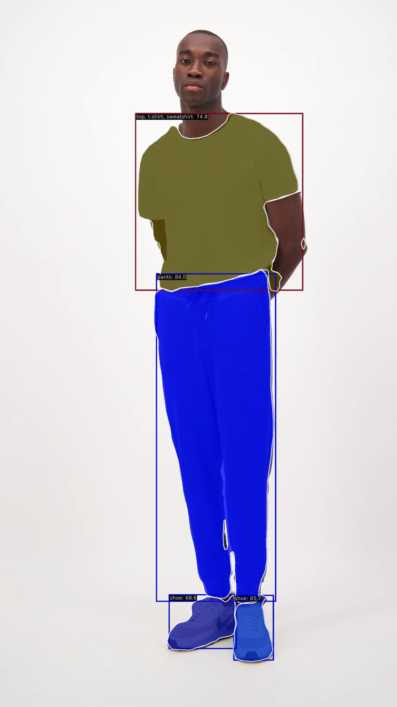

<p align="center"></p>


# Instance segmentation using RTMDet
RTMDet is state-of-the-art architecture for real-time instance segmentation\
and this repo contains codes to train and inference using this model
## requirements and installation
first of all pytorch and torchvision should be installed.\
then, install openmim to install mmlab's packages :
```
pip install -U openmim
```
then install mmengine and mmcv (mmcv version should be higher than 2.x :
```
mim install mmengine
mim install "mmcv>=2.0.0rc1"
```
after that , you should clone mmdetection repository\
the version in which RTMDet is available is mmdetection 3.x so :
```
!git clone https://github.com/open-mmlab/mmdetection.git -b 3.x
%cd mmdetection
!pip install -v -e .
%cd ..
```
We add ```-e``` to change this library's code without reinstalling
## Training
To train on a custom dataset just use the script used in ```train.py```\
here is and example for training :
```
python ./train.py ./rtmdet-ins_s_8xb32-300e_coco.py --auto-scale-lr --resume --launcher pytorch
```
## inference
To get inference on data you should use ```inference.py``` file (inference can be async too)\
here is an example of getting inference :
```
!python inference.py --config ./rtmdet-ins_s_8xb32-300e_coco.py --checkpoint /saved_models/epoch_14.pth --result_dest ./results/result.jpg --image ./dataset/test/e6e27f124b9b48926ea89258538f2cef.jpg --pred_thr 0.35
```
## Streamlit demo
To launch streamlit demo on local run this code :
```
streamlit run ./app.py
```
## Model Comparison
To see reports about model comparison with YOLOv8 refer to ```model_comparison.pdf```
## Dataset Report
To get a report from a COCO dataset use ```utils/dataset_report.py```
arguments are annotation file and dataset images directory :
```
python ./utils/dataset_report.py --ann ./instances.json --data-dir ./dataset/train
```
